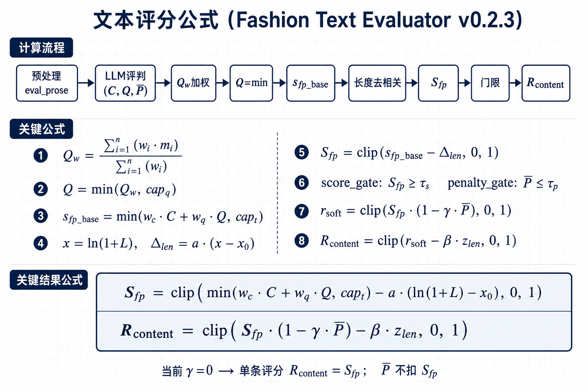

# 文本评分公式说明

> 规范：`fashion_prompt_optimizer_spec.json`（v0.2.3）  
> 代码：`design_text_evaluator_api.py` · `r_content_reward.py` · `score_formula.py`



---

## 1. 符号

| 符号 | 含义 |
|------|------|
| C | 覆盖度轴：适用 coverage 指标的算术平均 |
| Q_w | 质量模块加权均分 |
| Q | 质量有效分（经 cap，**不含** penalty） |
| w_c, w_q | 覆盖 / 质量轴权重（见 spec） |
| cap_q, cap_t | 质量分上限、总分上限 |
| L | strip 后正文字符数 eval_prose |
| x | 对数长度 x = ln(1 + L) |
| x_0 | 留出集对数长度中心 log_len_center |
| a | 长度斜率（留出集拟合） |
| Δ_len | 长度校正量 |
| S_fp | 最终综合分 total_score |
| P̄ | 惩罚项算术平均 total_penalty |
| γ | 惩罚乘性并入系数 gamma_penalty |
| β | 组内长度修正系数 beta_z_len |
| z_len | 组内 log 长度 z-score |
| τ_s, τ_p | 得分 / 惩罚门限 |
| R_content | RL/GRPO 奖励标量 |

---

## 2. 流程（文字）

1. **预处理**：去掉 T2I 固定句、章节标题、Key elements 等，得到 eval_prose；长度 L 与 LLM 评判基于该正文。
2. **LLM 评判**：coverage（0/1）、quality（五档 0~1）、penalty 四项（0~1）；不适用项跳过。
3. **质量加权**：六个 quality 子模块按 spec 权重求 Q_w。
4. **质量有效分**：Q = min(Q_w, cap_q)；penalty **不参与** Q 与 S_fp。
5. **内容主分**：s_fp_base = min(w_c·C + w_q·Q, cap_t)。
6. **长度去相关**：以典型长度 L_ref = exp(x_0) − 1 为锚，扣减相对偏长分量，得 S_fp。
7. **双门限**：S_fp ≥ τ_s 且 P̄ ≤ τ_p；P̄ 不扣 S_fp。
8. **R_content**：单条评分通常等于 S_fp；GRPO 同组 K 条可加 z_len 修正。

运行时逐步拆解见每条结果的 `score_formula` 字段。

---

## 3. 关键公式

```
Q_w = Σ(w_i · m_i) / Σ(w_i)

Q = min(Q_w, cap_q)

s_fp_base = min(w_c · C + w_q · Q, cap_t)

x = ln(1 + L)
Δ_len = a · (x - x_0)

S_fp = clip(s_fp_base - Δ_len, 0, 1)

score_gate:  S_fp ≥ τ_s
penalty_gate: P̄ ≤ τ_p

r_soft = clip(S_fp · (1 - γ · P̄), 0, 1)

单条:     R_content = r_soft
GRPO组内: R_content = clip(r_soft - β · z_len, 0, 1)
```

---

## 4. 一行总式

```
S_fp = clip( min(w_c·C + w_q·Q, cap_t) - a·(ln(1+L) - x_0), 0, 1 )

R_content = clip( S_fp·(1 - γ·P̄) - β·z_len, 0, 1 )
```

当前 spec 中 **γ = 0**，单条评分时 **R_content = S_fp**；P̄ 仅用于 penalty_gate。

---

## 5. 补充

- **长度模式**：生产仅用 centered_slope（上式）；legacy_regression 仅供离线复现。
- **惩罚并入**：仅 multiply，即 (1 − γ·P̄) 乘性折扣。
- **系数更新**：批量评分后用 `fit_holdout_length_centered(s_fp_bases, char_lens)` 拟合 a、x_0，写入 spec。

```python
from plugins.text_description_evaluator import fit_holdout_length_centered
a, x_0 = fit_holdout_length_centered(s_fp_bases, eval_prose_char_lens)
```
