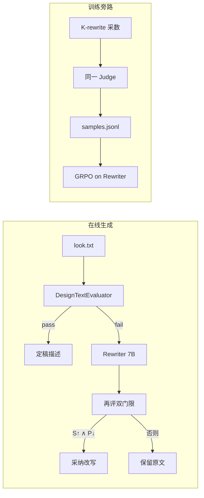

# 评分模型构建 · 论文流程图说明

供后续绘制论文用 **评分体系架构图 / 聚合公式图**，并配套文字阐述。  
本文回答：**评分模型是怎样构建的、有哪些设计点**（不含 ODIN / 双头 RM 蒸馏层）。  
指标细表（Cov / Q / Pen 维度）见姊妹文档 [`得分项与惩罚项_论文维度表说明.md`](得分项与惩罚项_论文维度表说明.md)；在线生成主干见 [`生成工作流主干_论文流程图说明.md`](生成工作流主干_论文流程图说明.md)。

**规格真相源**：`plugins/text_description_evaluator/fashion_prompt_optimizer_spec.json`（v0.5.1）  
**公式规范**：`plugins/text_description_evaluator/SCORE_FORMULA.md`  
**实现入口**：`DesignTextEvaluator` · `ApiLLMJudge`

---

## 0. 一句话定位

> **生产路径是「结构化 schema + LLM-as-judge」**：同一套指标规格、同一 system prompt、同一聚合公式；本地 7B 与 GPT teacher 只换 backend。  
> 输出内容主分 \(S_{fp}\)、惩罚均值 \(\bar P\)；双门限决定过关 / 触发改写；训练侧现行奖励 \(R_{content}=s_{fp\_base}\)。

现行配置快照（`fashion_config.yaml` + spec）：

| 项 | 现行值 |
|---|---|
| Workflow judge | 本地 `Qwen2.5-7B-Instruct`（冻结） |
| GPT teacher | `gpt-5.4-mini`（对照评测） |
| \(\gamma\) / \(\beta\) | 均为 **0**（惩罚与组内 z_len 不进奖励） |
| 双门限 | \(S_{fp}\ge 0.8\) 且 \(\bar P\le 0.25\) |
| \(R_{content}\) | \(= s_{fp\_base}\) |

---

## 1. 建议论文图结构（两图）

### 图 A · 评分模型总览（What is the scorer）

三区横排：

```
┌──────────────────────┐  ┌──────────────────────┐  ┌──────────────────────┐
│ Spec Layer           │  │ Judge Layer          │  │ Decision Layer       │
│ fashion_prompt_      │→ │ ApiLLMJudge          │→ │ Aggregate + Dual Gate │
│ optimizer_spec.json  │  │ (GPT teacher /       │  │ S_fp, P̄, R_content   │
│ modules · weights ·  │  │  local 7B same schema)│  │ pass / fail / adopt  │
│ rubrics · gates      │  │                      │  │                      │
└──────────────────────┘  └──────────────────────┘  └──────────────────────┘
```

**题注建议（中）**  
> 图 A. 评分模型构建总览：规格层定义指标与权重；评判层为 LLM-as-judge；决策层输出内容主分、惩罚与双门限。

**题注建议（EN）**  
> Figure A. Scoring-model construction: a shared structured schema, an LLM-as-judge backend, and dual-gate decisions.

### 图 B · 单条评判聚合（How one score is built）

```
text_description
        │
        ▼
 strip boilerplate ──► eval_prose
        │
        ├─► Coverage modules (0/1) ──────────────► C
        ├─► Quality modules (5-level)
        │     + few-shot calib. on 5 metrics
        │     + rule caps ───────────────────────► Q_w → Q
        └─► 5 Penalties (5-level) + floors ──────► P̄
        │
        ▼
 S_fp = min(0.2·C + 0.8·Q, 1.0)     (= s_fp_base)
        │
        ├─► Dual Gate: S_fp ≥ τ_s  ∧  P̄ ≤ τ_p
        └─► R_content = s_fp_base   (γ=β=0)
```

---

## 2. 构建分层：评分模型由什么组成

### 2.1 规格层（Schema / Spec）——「评什么、怎么加权」

真相源：`fashion_prompt_optimizer_spec.json`

| 积木 | 内容 | 设计意图 |
|---|---|---|
| `score_axes` | Coverage(0.2) · Quality(0.8) · Bonus(0.0) | 「有没有」轻、「好不好」重；叙事加分不进总分 |
| `coverage_modules` | GarmentCore / MaterialColor / ConstructionDetail / StylingSet / Composition | 覆盖可成像服装要素 |
| `quality_module_weights` | DesignMerit **10**；密度/可见性/生成适配各 **5**；绑定/语言/结构各 **1** | 把「识别性设计想法」抬到主导地位 |
| 指标级 `few_shot` | 5 个质量指标各挂标定样例（见 §2.2.1） | 把抽象 rubric 锚到可对标的分数档 |
| `penalty_registry` | 5 项局部质量惩罚 | 缺陷单独成门，不污染内容主分 |
| `optimization_gates` | \(\tau_s=0.8,\ \tau_p=0.25\) | 内容够好 **且** 局部缺陷不过重 |

### 2.2 评判层（LLM-as-Judge）——「谁打分」

| 组件 | 路径 / 符号 | 说明 |
|---|---|---|
| 系统提示 | `fashion_sys_prompt.txt` | 与规格对齐的打分指令 |
| 裁判封装 | `ApiLLMJudge` | OpenAI-compatible chat；解析模块 JSON；注入 few-shot |
| 评估器 | `DesignTextEvaluator.evaluate_text` | 预处理 → 调裁判 → 规则 cap/floor → 聚合 → 门限 |
| 本地 backend | `plugins/local_llm.build_workflow_text_evaluator` | workflow 现行：冻结 7B |
| Teacher backend | `grpo.design-text-evaluator` → `gpt-5.4-mini` | 对照评测 |

**构建要点**：Teacher 与 Student **共用同一 schema + 同一聚合公式**，只换 endpoint；对照评测可比，切回 GPT 零公式迁移。

#### 2.2.1 Few-shot 标定（裁判校准设计）

质量轴里权重为 5 的三类模块（信息密度 / 可见性优先级 / 生成适配，含左右一致性与空间关系）在 spec 指标上挂 `few_shot` 数组；裁判 user prompt 检测到该字段后追加统一 **Few-shot template** 指令。

**挂载指标（5）**

| 指标 | 所属模块 | 标定意图（简述） |
|---|---|---|
| `information_density` | InformationDensity | 新事实 vs 复述 vs「删锚点装短」 |
| `visibility_priority` | ConcisenessAndDensity | 可见服装优先 vs 姿态/场域稀释 vs 编号/离身平铺 |
| `generation_readiness` | GenerationReadiness | 单帧可画 vs 氛围半文 vs 双下装/双袖冲突 |
| `bilateral_coherence` | GenerationReadiness | 不适用 / 单侧落点 / 单维分裂 / 多维分裂 |
| `spatial_coherence` | GenerationReadiness | 不适用 / 可还原附着 / 位置含糊 / 固定点缺失 |

**样例条目结构**（spec 内）：`text` · `applicable` · `score`（或 `null` 表示不适用）· `because`。

**Prompt 注入规则**（`ApiLLMJudge`，模块内任一指标带 `few_shot` 即启用）：

1. `few_shot` 是**标定样例**，不是待评正文，禁止当评价对象打分。  
2. 先匹配**同类模式**的样例，再取该档分数。  
3. **不得高于**展示同类缺陷的样例分。  
4. **短本身不加分**（堵住「删事实换短句」刷信息密度）。

**设计意图**：这五档质量项语义边界细、7B 易漂移；few-shot 把「最近邻例」写进 prompt，与权重 5 的重点模块对齐。DesignMerit 等其余质量项**不**挂 few-shot，仍靠 rubric + 规则 cap。

画图建议：在 Judge 盒内加小标注  
`Few-shot calib. → density / visibility / generation-readiness family`。

### 2.3 决策层（Aggregate + Dual Gate）——「分数怎么用」

| 输出 | 用途 |
|---|---|
| \(S_{fp}\)（= `s_fp_base`） | `score_gate`；改写采纳比较；验收质量轴 |
| \(\bar P\) | **仅** `penalty_gate`；**不扣减** \(S_{fp}/R_{content}\) |
| `both_passed` | 是否早停 / 是否触发改写 |
| \(R_{content}\) | GRPO 主奖励（现行 \(= s_{fp\_base}\)） |

---

## 3. 聚合公式（作图可直接贴）

### 3.1 符号

| 符号 | 含义 |
|---|---|
| \(C\) | 适用 coverage 指标的 0/1 算术平均 |
| \(Q_w\) | 质量模块加权均分 |
| \(Q\) | \(\min(Q_w, cap_q)\)；**不含** penalty |
| \(S_{fp}\) | 内容主分；现行 \(= s_{fp\_base}\) |
| \(\bar P\) | 五项惩罚算术平均 |
| \(\tau_s,\tau_p\) | 得分 / 惩罚门限 |
| \(R_{content}\) | RL/GRPO 内容通道奖励 |

### 3.2 现行默认（\(\gamma=0,\beta=0\)）

\[
\begin{aligned}
Q_w &= \frac{\sum_i w_i m_i}{\sum_i w_i}, \\
Q &= \min(Q_w,\, cap_q), \\
s_{fp\_base} &= \min(0.2\,C + 0.8\,Q,\, 1.0), \\
S_{fp} &= s_{fp\_base}, \\
\bar P &= \mathrm{mean}(P_i), \\
\text{pass} &\iff S_{fp}\ge 0.8\ \land\ \bar P\le 0.25, \\
R_{content} &= s_{fp\_base}.
\end{aligned}
\]

质量模块权重 \(w_i\)：DesignMerit 10 · ConcisenessAndDensity / InformationDensity / GenerationReadiness 各 5 · BindingAccuracy / LanguageClarity / StructuralClarity 各 1。

### 3.3 规则硬约束（补强裁判）

画图时可在 Quality / Penalty 旁加「Rule Caps / Floors」虚线框：

| 规则 | 效果 |
|---|---|
| BindingAccuracy \(< 0.5\) | 质量有效分更紧的 cap（工程上 ≤ 0.6） |
| 冲突 / 拼贴板激活 | Quality 进入总分的加成封顶（`CONFLICT_QUALITY_CAP=0.25`） |
| 一致性与协调性惩罚同时 \(\ge 0.75\) | \(\bar P \ge 0.30\) → **必然**不过 `penalty_gate` |
| DesignMerit greedy 解码 | `design-merit-temperature: 0.0`，避免平庸叠穿被随机打高 |

---

## 4. 设计点清单（阐述用 bullet）

按「为什么这样建」组织；作图时可做成侧栏 callout 或独立 Design Rationale 框。

### D1. 内容分与惩罚分分离

- **做法**：惩罚五项只进 \(\bar P\) 与 `penalty_gate`，\(\gamma=0\) 时**不乘进** \(S_{fp}/R_{content}\)。
- **动机**：避免「靠扣分扭曲组内排序」；内容好不好与局部缺陷是否过重是两个正交问题。
- **后果**：双门限必须**同时**通过；改写采纳亦要求 \(S_{fp}\uparrow\) 且 \(\bar P\downarrow\)。

### D2. 覆盖轻、质量重，加分轴权重为 0

- **做法**：\(w_c=0.2,\ w_q=0.8\)；Bonus 权重 0。
- **动机**：T2I 友好描述的关键不是「写全清单」，而是「写得可成像、有识别性设计」；品牌/叙事增强不抬总分，防风格话术刷分。

### D3. DesignMerit 主导质量轴

- **做法**：模块权重 10（远高于其它）；指标围绕「换色换面料后仍认得的想法」。
- **动机**：时尚 look 的核心价值是识别性设计，而非 checklist 式堆砌。
- **配套**：生成侧 `task-notes` / `fashion.py` 约束与裁判口径对齐（写 judge 会给高分的那种 novelty）。

### D4. 长度不进总分

- **做法**：`holdout_regression.mix_into_score=false`；长度相关 \(a,x_0\) 仅诊断；现行 \(\beta=0\)。
- **动机**：防止策略「写长得高分」；验收可看 \(\rho(R_{content},\log L)\) 是否接近 0。

### D5. Teacher / Student 同 schema

- **做法**：本地 7B 与 GPT teacher 共用 spec、prompt、聚合；仅 backend 不同。
- **动机**：对照评测可比；切回 GPT 零公式迁移。

### D6. 规则硬地板补强弱裁判

- **做法**：冲突质量 cap、惩罚双高强制不过门、DesignMerit greedy。
- **动机**：7B judge 对「第二身份 / 拼贴板」不稳定；规则级 floor/cap 把灾难稿钉死在门限外。

### D7. 角色三分：Judge / Rewriter / Vision

- **做法**：基座 7B 生成+评分（冻）；Rewriter 7B（8001）才是 SFT/GRPO 对象；多模态仍走 GPT vision。
- **动机**：评分器稳定、可复现；策略更新不污染裁判；读图能力与文本裁判解耦。

### D8. 改写采纳的相对提升准则

- **做法**：相对原文须总分更高且惩罚更低，再取总分最高；否则留原文。
- **动机**：防止「过门但更差」或「惩罚更低但内容塌」的替换。

### D9. 重点质量项 Few-shot 标定

- **做法**：`information_density` / `visibility_priority` / `generation_readiness` / `bilateral_coherence` / `spatial_coherence` 在 spec 挂标定样例；裁判 prompt 统一要求「对最近同类例打分、不得高于同类缺陷例、短不加分」。
- **动机**：这五项权重高（模块权重 5）、边界细；用可对标样例压住 7B 漂移，并显式禁止「删识别锚点装短」当高密度。
- **非范围**：DesignMerit、绑定/语言/结构清晰、Coverage、Penalty **不**依赖 few-shot（靠 rubric / 硬规则）。

---

## 5. 与系统其它模块的接口



| 消费方 | 读哪些量 |
|---|---|
| Workflow 门控 / 改写 | \(S_{fp}\)、\(\bar P\)、双门限、诊断模块 |
| GRPO | `reward_scalar` / \(R_{content}\)（现行 \(= s_{fp\_base}\)） |
| 验收 / 汇报 | \(S_{fp}\) 提升、惩罚下降 |

---

## 6. 主图各块英文文案（便于出图）

| Block | Suggested label |
|---|---|
| Spec | Structured Scoring Spec (axes · modules · weights · gates) |
| Judge | LLM-as-Judge (shared schema; frozen 7B / GPT teacher) |
| Coverage | Coverage Axis \(C\) (binary hits, \(w=0.2\)) |
| Quality | Quality Axis \(Q\) (5-level; DesignMerit-heavy, \(w=0.8\)) |
| Few-shot | Calibration examples on density / visibility / gen-readiness family |
| Penalty | Local Penalties \(\bar P\) (gate-only) |
| Aggregate | \(S_{fp}=\min(0.2C+0.8Q,1)\) |
| Dual Gate | Score gate \(\ge 0.8\) ∧ Penalty gate \(\le 0.25\) |
| Reward | \(R_{content}=s_{fp\_base}\) |

---

## 7. 阐述提纲（口头 / 论文段落可直接改编）

1. **定位**：评分模型不是端到端黑盒回归器，而是「可解释多维 schema + LLM 裁判 + 规则聚合」。  
2. **分层构建**：先定评什么（spec），再定谁评（judge backend），再定怎么合成与门控（公式 + dual gate）。  
3. **关键公式**：一行写清 \(S_{fp}=0.2C+0.8Q\)；强调 \(\bar P\) 不进总分。  
4. **设计主线**：内容/惩罚分离、长度不进总分、DesignMerit 主导、Teacher–Student 同口径、规则补强弱裁判、重点质量项 few-shot 标定。  
5. **Few-shot**：五档质量指标挂标定样例；对最近同类例打分、不得高于同类缺陷例、短不加分。  
6. **系统角色**：Judge 冻结提供稳定标签；Rewriter 才是策略；Vision 另路。

---

## 8. 代码锚点速查

| 用途 | 路径 |
|---|---|
| 规格 | `plugins/text_description_evaluator/fashion_prompt_optimizer_spec.json` |
| 评判 / 聚合 / 门限 | `plugins/text_description_evaluator/design_text_evaluator_api.py` |
| \(R_{content}\) 载荷 | `plugins/text_description_evaluator/r_content_reward.py` |
| 公式 breakdown | `plugins/text_description_evaluator/score_formula.py` |
| 本地 judge 装配 | `plugins/local_llm.py` |
| GRPO 取奖励 | `training/grpo_compute.py` · `pick_reward_scalar` |
| 运行时配置 | `fashion_config.yaml` → `text-evaluator` / `grpo` |

---

## 9. 勿画进「评分模型构建」主图的内容

- 主题分析 / 概念 / 元素多智能体细节（属生成主干图）  
- T2I 与 Vision Reflect（属生成主干图）  
- K 路温度扇出、子主题补位等工程细节  
- 指标全表逐条 Key Point（属维度表文档）  
- ODIN / 双头 RM / 蒸馏层（本文刻意不展开）  

主图只保留：**Spec（含 few-shot）→ Judge → Aggregate / Dual Gate → \(S_{fp}\)、\(\bar P\)、\(R_{content}\)**。
